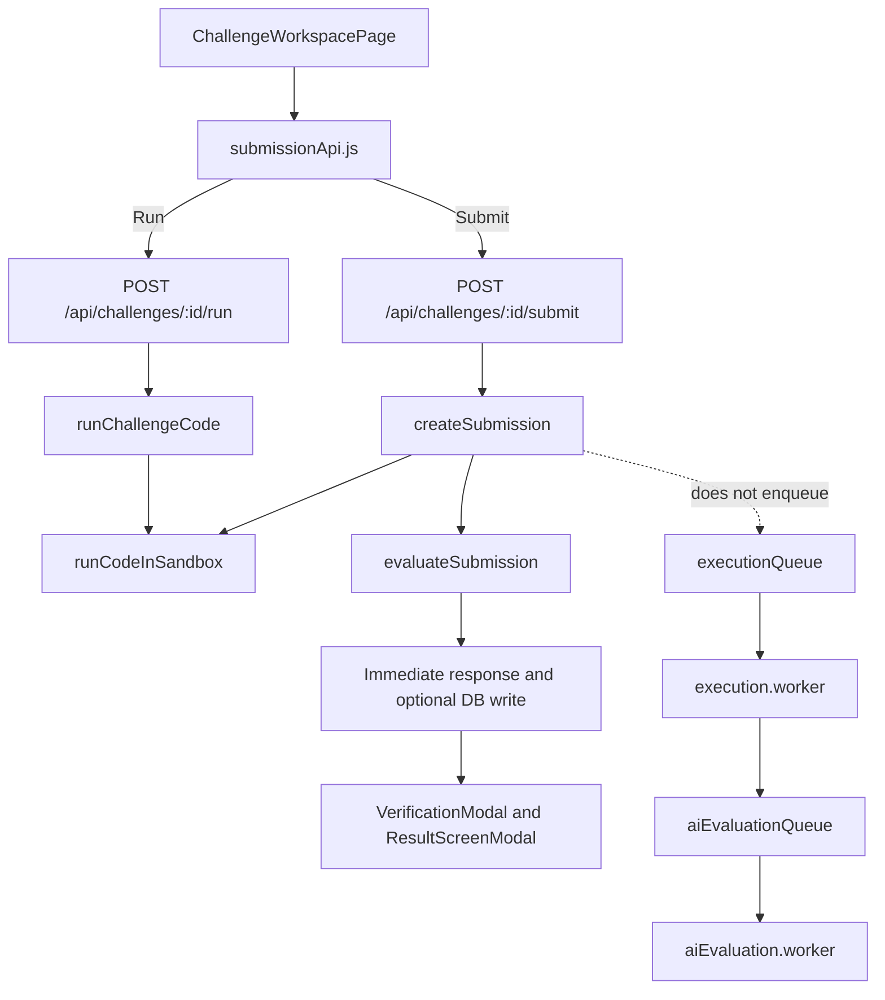

# VerifAI Submission Feature: Engineering Handoff

This document is a self-contained brief for the engineer or coding agent repairing the submission and scoring feature. It describes the implementation observed in this repository on 2026-09-27, identifies verified failure modes, and defines a target contract. It is not a claim that the proposed behavior is already implemented.

## Mission

Make challenge submissions trustworthy end to end. A user must receive a score that reflects the correct challenge, the actual submitted code, the challenge's authoritative tests, and a documented scoring policy. A failed request, missing test suite, unavailable evaluator, or malformed AI response must never look like a passing evaluation or issue a credential.

Work from the current branch state (submission/UI, commit `4a85427` at time of analysis). Inspect the current code before changing it. Keep unrelated work intact. Do not solve this by merely changing score weights or replacing one fabricated fallback score with another.

`BRAIN.md` and `server/src/tests` history are partly stale: `BRAIN.md` says submissions, queues, and AI review do not exist, although code for them is now present. The current package test script also points to a directory that does not contain the actual tests. Treat the source files listed below as the current implementation evidence.

## Product Contract

- A challenge is resolved to one persisted challenge record. Unknown IDs/slugs fail clearly; they must not silently become the default rate-limiter challenge.
- The server owns the challenge definition, execution type, test cases, hidden tests, rubric, score policy, and credential decision. Client-supplied challenge metadata is display context only, never grading authority.
- Official submissions are authenticated and persisted. Interactive runs may be a separate, rate-limited workflow, but they do not issue scores or credentials.
- Test execution is authoritative for correctness. AI can assess qualitative dimensions only; it cannot turn failed tests into passing correctness or override a failed execution.
- A missing or empty automated test suite is not a pass. `review_only` challenges must follow an explicit review-only contract and must not be presented as automatically test-verified.
- Errors and pending states are visible as errors and pending states. There is no fake offline score, fake submission ID, fake badge, or fabricated successful pipeline stage.
- Hidden test inputs, expected outputs, and reference solutions never go to the browser, ordinary API responses, or client bundles.
- The execution boundary must safely handle untrusted code with enforced wall-clock, CPU, memory, and output limits. Node's `vm` module is not a security boundary.

## Current Request Flow



The dotted queue path is present in code but is not used by the current submit controller. `server/server.js` loads the workers, but loading a worker does not enqueue a job. If Redis is absent, both queue modules substitute a no-op queue.

## Relevant Source Map

- Workspace state, challenge loading, Run and Submit actions: [ChallengeWorkspacePage.jsx](client/src/pages/ChallengeWorkspacePage.jsx)
- Client API, local evaluator, and network-error fallback: [submissionApi.js](client/src/features/challenges/api/submissionApi.js)
- Bundled challenge catalog and mock results: [mockChallengeData.js](client/src/features/challenges/data/mockChallengeData.js)
- Verification animation and its fallback values: [VerificationModal.jsx](client/src/features/challenges/components/VerificationModal.jsx)
- Score, threshold, subscores, and badge presentation: [ResultScreenModal.jsx](client/src/features/challenges/components/ResultScreenModal.jsx)
- Submit/run handlers and immediate persistence: [submission.controller.js](server/src/controllers/submission.controller.js)
- Challenge-scoped submit/run routes: [challenge.routes.js](server/src/routes/challenge.routes.js)
- Canonical submission routes: [submission.routes.js](server/src/routes/submission.routes.js)
- Request validation: [submission.validator.js](server/src/validators/submission.validator.js)
- Current submission persistence schema: [Submission.js](server/src/models/Submission.js)
- Challenge test/rubric/execution schema: [Challenge.js](server/src/models/Challenge.js)
- Current JavaScript runner: [sandboxExecutor.js](server/src/utils/sandboxExecutor.js)
- AI evaluator and heuristic fallback: [aiEvaluator.js](server/src/utils/aiEvaluator.js)
- Existing external execution client (named Judge0 but configured for JDoodle): [judge0Client.js](server/src/utils/judge0Client.js)
- Queue setup: [execution.queue.js](server/src/queues/execution.queue.js), [aiEvaluation.queue.js](server/src/queues/aiEvaluation.queue.js)
- Worker implementations: [execution.worker.js](server/src/workers/execution.worker.js), [aiEvaluation.worker.js](server/src/workers/aiEvaluation.worker.js)
- Server startup and worker loading: [server.js](server/server.js)
- Existing user badge storage: [User.js](server/src/models/User.js)
- Existing tests: [sendEmail.test.js](server/src/tests/sendEmail.test.js)

## Verified Failure Modes

### P0: Correctness and score are not trustworthy

1. `runCodeInSandbox` is a challenge-specific TokenBucket runner disguised as a generic runner. For `allow`, it ignores each test case's input and chooses behavior by test index. For other classes, it constructs a fresh instance for every case, so stateful multi-operation challenges cannot be tested as a sequence. It constructs targets with `(10, 2)` rather than using each challenge's declared input/constructor contract. It does not consistently support the static methods and adapters handled by the client evaluator.
2. The server runner ignores the requested language and only evaluates JavaScript. The client currently hard-codes `language: "javascript"`, although the server has a separate external-execution utility with language mappings. Unsupported language or runner behavior must be an explicit error, not a misleading score.
3. The heuristic in `aiEvaluator.js` treats zero tests as a 100% pass ratio. This was reproduced locally: empty code plus an empty test list returned score 94, correctness 100, and “production-ready” feedback. It awards minimum score bands (88-98 for all-pass, 62-78 for at least half, 25-55 otherwise), so the score is not a direct consequence of demonstrated correctness or a documented rubric.
4. The Gemini result is parsed with `JSON.parse` but is not schema-validated. Scores/subscores can be absent, inconsistent, non-finite, or outside 0-100. Passing tests only impose a lower bound of 88; there is no strict score cap or consistency check. AI output is therefore not a reliable scoring contract.
5. Submission creation falls back to hard-coded TokenBucket challenge metadata and hard-coded test cases when it cannot resolve the challenge. The client sends challenge metadata but does not send authoritative tests; the server must not grade a different/default problem when lookup fails.
6. Challenge test fixtures in `mockChallengeData.js` contain client-visible hidden cases, expected/actual outputs, pass flags, and precomputed AI scores. Any secret tests in this catalog are public to every browser user and can be read from the bundle/source.

### P0: Execution and UI can report fake success

1. `sandboxExecutor.js` uses `node:vm`. The timeout wraps creation/evaluation of the wrapper, but calls into the returned candidate function/class happen outside that timeout. A loop in a candidate method can block the server. `node:vm` must not be treated as safe isolation for arbitrary user code. The browser fallback uses `new Function`, which executes candidate code in the user's page context and is not a secure grading environment either.
2. `submitChallengeSolution` catches any backend error and computes a local score using another heuristic, returning a synthetic badge ID. `ChallengeWorkspacePage` also opens the verification flow after submission failure. `VerificationModal` invents default test counts, a score of 92, and success logs claiming Judge0, AST analysis, Moss, and anti-cheat work. `ResultScreenModal` has additional score/threshold/subscore defaults. These paths convert infrastructure errors into apparently successful results.
3. The challenge page can fall back to default/mock challenge data when loading a real challenge fails. The user can then submit against a different/default challenge while believing they are solving the selected one.

### P1: Two submission pipelines and inconsistent API contract

1. `createSubmission` runs execution and AI evaluation synchronously in the HTTP request, then optionally persists the completed record. It does not create a queued record or call `executionQueue.add`.
2. The worker pipeline separately implements queued -> running -> judge0_done -> ai_reviewing -> completed/failed, but the current controller does not drive it. With no Redis, queue `add` and `process` are no-ops. There is no functioning asynchronous contract despite the UI naming a verification pipeline.
3. The client uses `/api/challenges/:id/submit`; `/api/submissions` also exposes submit but the client does not use it. The challenge-scoped submit route has no submission validator and uses optional auth. The canonical submit route validates some fields but also uses optional auth. Pick one canonical service/contract and make aliases delegate to it.
4. Official submissions can be anonymous. In that case the response includes a synthetic `sub_<time>` ID and can say a badge was issued, even though no submission or badge was persisted. An official score/credential must have an authenticated owner and durable record.
5. `keystrokeCount` and `timeSpentSeconds` are sent by the client but are not stored or evaluated. Keystroke count increments per editor change event, not per actual key. Do not treat these as implemented anti-cheat evidence.
6. The client GETs challenge submissions at `/api/challenges/:id/submissions`, but the optional-auth handler returns every user's submissions when no user is authenticated. Limit the endpoint to the owner/privileged roles or remove it from public use.

### P1: Hidden-test and result privacy

1. `runChallengeCode` loads full database test cases, including hidden cases, and returns all test results with expected output and `isHidden`. Hidden test inputs/expected values must not leave the server.
2. The mock challenge catalog already exposes hidden test vectors. Move authoritative test definitions to server-only fixtures/database records; client data may contain public examples only.
3. Verify socket room authorization before allowing a client-supplied `userId` to join a room. Submission events must only be visible to the owning user and authorized staff.

### P2: Test and maintainability gaps

1. `server/package.json` runs `node --test tests/*.test.js`, but tests are under `server/src/tests`. The configured command discovered zero tests. Running `node --test src/tests/*.test.js` discovered and passed the three email tests.
2. There are no submission, executor, scoring, API, persistence, or client workflow tests. The client lint script is not currently runnable because ESLint is not installed/configured.
3. `judge0Client.js` actually calls JDoodle, while its name and the UI imply Judge0. Confirm the intended provider and environment contract. Do not claim static analysis, AST analysis, anti-cheat, or real-time processing unless those steps truly execute.

## Required Target Design

### 1. One authoritative submission service

- Resolve challenge by a validated database ID (or an explicitly supported slug). Return 404 for unknown challenge. Remove title-regex/default challenge grading fallback.
- Validate code size, language against a server allowlist, challenge ID, execution type, and auth. The server fetches tests and rubric itself. Ignore/reject client attempts to provide authoritative test cases, expected outputs, rubric, or score.
- Keep interactive Run separate from official Submit. Run may execute only public tests and returns no score/badge; Submit evaluates server-owned full tests and stores a durable record.
- Keep legacy route aliases only if necessary; they must call the same service and return the same response schema.

### 2. Explicit execution contract

- Define how each challenge's input is invoked: function, class with constructor arguments, stateful operation sequence, or standard input/output. Store or version that contract with the challenge. Do not infer semantics from class names, array index, or magic method names.
- For stateful challenges, represent one test as a sequence of operations against one instance with expected output per operation or a canonical final result. Do not recreate the instance for every operation.
- Compare outputs using an explicit type-aware normalization rule. Do not case-fold arbitrary strings or compare JSON objects by unstable property order.
- Execute candidate code only in a real isolation boundary (for example, a maintained remote execution service or a restricted disposable process/container with enforced resource limits). `node:vm` and browser `new Function` are not substitutes. Set wall-clock, CPU, memory, stdout/stderr, and concurrency limits; handle compile errors, runtime errors, timeouts, and provider failures distinctly.
- Use one chosen provider. If JDoodle remains the provider, rename/document the integration and test its version/language mapping. Do not describe it as Judge0.

### 3. Versioned score policy

Use a deterministic server-owned policy, stored with each result (for example, `scoreVersion`). Suggested v1 for `testcases` and `both` challenges:

```text
correctness = 100 * weighted_points_passed / weighted_points_total
finalScore = round(0.70 * correctness
                 + 0.15 * codeQuality
                 + 0.10 * efficiency
                 + 0.05 * edgeCases)
```

- A missing/empty automated suite is an evaluation error, never 100% correctness.
- Test results determine correctness. AI may provide bounded, schema-validated qualitative subscores and evidence, but cannot change test outcomes or correctness.
- Require all required tests to pass as a separate badge eligibility gate, in addition to the configured score threshold. A numeric score alone does not issue a badge.
- Centralize weights and threshold; do not duplicate them in controller, worker, and client. Validate every AI number is finite and between 0 and 100; validate required arrays/fields and reject malformed output. AI failure should leave qualitative review pending/failed and must not manufacture a successful result.
- For `review_only`, use an explicit rubric-only result shape with no fabricated automated correctness. Define whether it can issue a credential and whether it requires human review. Do not reuse the automated-test formula with implicit “all passed”.
- Store the exact execution summary, score version, qualitative evaluation, evaluator/provider version, and credential decision on the submission so a score can be explained and audited later.

If product owners choose different weights or badge rules, document and test those rules before implementation. The crucial invariant is that score and badge decisions are deterministic, explainable, and cannot contradict test evidence.

### 4. Persisted asynchronous lifecycle

Use one lifecycle from HTTP submission through workers:

1. Authenticated `POST /api/submissions` validates and creates a `queued` record, then enqueues the ID. Return `202` with `{ submissionId, status: "queued" }`.
2. Execution worker updates status and authoritative test results; then dispatches qualitative review when applicable.
3. Evaluation worker validates structured output, computes final score centrally, applies the badge gate, and persists atomically/idempotently.
4. `GET /api/submissions/:id` returns current status/result only to the owner or authorized staff. Socket notifications may supplement polling, not replace persistence or authorization.
5. Any failure becomes a durable `failed` state with a safe, useful error code/message. No synthetic ID, local result, badge, or success-shaped response.
6. Define behavior when Redis/provider is unavailable. Either reject submission with a clear retryable service error or use a real, monitored durable fallback; a silent no-op queue is not acceptable.

### 5. Honest client states

- Backend submission result is the only source of official score, pass/fail, and credential status.
- If submission fails or is offline, show the error and retain the user's code; do not show a score or badge. Local evaluation can be explicitly labeled as a non-authoritative preview only, and must not use hidden tests or look like an official result.
- Drive verification UI from persisted server status/results. Remove hard-coded claims for Judge0, AST, Moss, anti-cheat, Gemini model, or “real-time” unless each is implemented and its result is available.
- Do not use mock `aiReview`, mock test `passed` fields, or default score values as submission results. Clearly distinguish loading, pending, completed, and failed states.
- `keystrokeCount`/time are optional telemetry only until genuinely measured, persisted, and validated. Never let them change score without a documented policy and tests.

## Implementation Order

1. Add reproducible tests for current scoring defects and the target score contract. Fix test discovery first.
2. Define/version the challenge execution adapter and validate challenge IDs, language, execution type, and test fixture shape.
3. Replace the unsafe/magic runner with the selected isolated execution service; test timeouts and resource limits.
4. Make submission persistence + queue dispatch the single official path. Remove direct duplicate scoring from the HTTP controller and make failure/retry behavior explicit.
5. Centralize score computation and credential eligibility. Add persistence/idempotency protections so retries or concurrent jobs cannot issue duplicate badges.
6. Remove client-bundle hidden tests and fake evaluation fields. Make frontend states reflect the real API lifecycle; preserve code on failures.
7. Add authorization/privacy tests for submission reads, hidden tests, and socket events; then run end-to-end verification.

Do not start by polishing the verification animation. First make the server's execution result and score truthful, then make the UI accurately display it.

## Minimum Test Matrix

- No tests / malformed challenge: evaluation fails; score and badge absent.
- Empty code, syntax error, runtime error, timeout, unsupported language, provider outage: distinct failure states; no false pass, no score, no badge.
- Correct solution passes all public and hidden tests; incorrect solution fails relevant cases and correctness equals the defined weighted result.
- A stateful multi-operation challenge preserves state within a test sequence and resets state between independent tests.
- Scalar, string, array, object, null, and boolean outputs use documented comparisons; ordering/formatting cases are deterministic.
- Same code against two challenge IDs uses each challenge's server-side tests and rubric; unknown ID never runs default tests.
- Public run results omit hidden inputs/expected outputs; hidden fixtures are absent from browser bundles and mock catalog.
- Gemini valid, malformed, missing, out-of-range, timeout, and unavailable responses; qualitative output never overrides correctness.
- Authenticated submit persists once, returns a durable ID, transitions through lifecycle, and fetches only for owner/staff. Anonymous official submit is rejected.
- Duplicate request/job/badge attempts are idempotent. Badge eligibility requires the documented gate and threshold.
- Frontend shows pending/completed/failed accurately; network failure, timeout, and offline mode never produce official score or credential.

## Verification Snapshot at Handoff

- `client`: `npm run build` passed on the analyzed tree.
- `client`: `npm run lint` could not run because `eslint` is not installed/configured.
- `server`: `npm test` exited successfully but discovered zero tests because the script points at `tests/*.test.js`.
- `server`: `node --test src/tests/*.test.js` discovered and passed the three existing email-helper tests.
- Direct heuristic probe: empty code and zero tests returned 94/100 with 100 correctness and production-ready language.

These are baseline observations, not validation of a future repair. After implementation, run the new focused tests, client build, corrected full server test command, and a MongoDB/queue/provider-backed submission flow where those services are available.